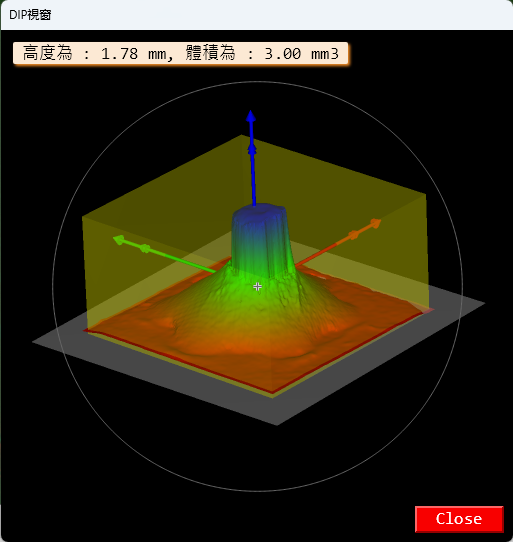

# Halcon 3D 量測的應用場景

在工業視覺中，3D 點雲常用來處理高度差、體積估算與瑕疵檢測。Halcon 在這部分已經有提供一些可直接使用的算子。

## 常見量測任務

- 高度量測
- 體積量測
- 缺陷表面分析

## 實作重點

在進行 3D 量測前，通常需要先完成下列步驟：

1. 點雲或深度資料取得
2. 去除雜訊與異常值
3. 建立基準面
4. 計算高度、面積或體積

## 要注意的事項

- 點雲精度會直接影響結果
- 量測基準面若不穩定，量測結果會飄動
- 資料前處理通常比量測函式本身更重要
