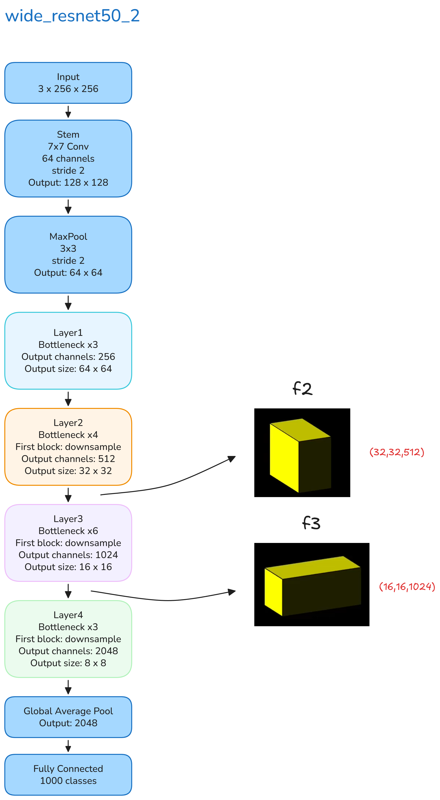
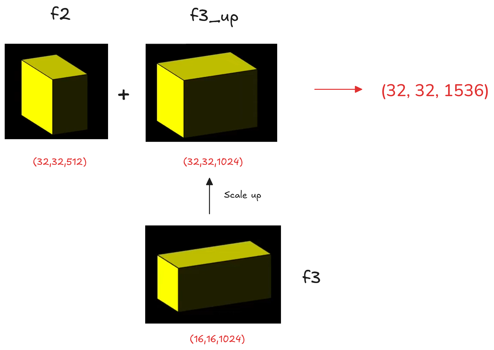
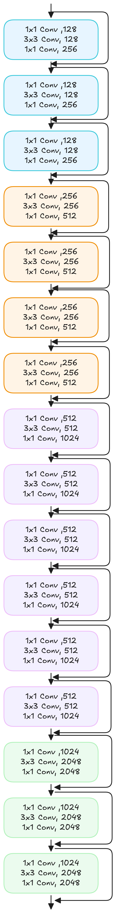

# 為什麼使用 PatchCore
在工業瑕疵檢測裡，常見情況是「正常品很多，異常品很少，而且異常型態不固定」。  
PatchCore 就是為這種情境設計的方法: **只用正常影像建立正常特徵庫，測試時再看新影像的局部特徵是否偏離這個特徵庫。**

它的重點不是重新訓練一個很大的深度模型，而是:

1. 用預訓練 CNN 擷取正常影像的 patch 特徵
2. 把這些正常 patch 特徵存成 Memory Bank
3. 測試時用最近鄰距離判斷每個 patch 是否異常

所以如果要用一句話描述 PatchCore:

**PatchCore 是一種以 patch-level 特徵比對為核心的記憶式異常檢測方法。**

# PatchCore 的流程

整體流程可以拆成三個部分:

1. 特徵擷取與 patch embedding
2. 建立 Memory Bank
3. 測試時計算 anomaly score

## 1. 特徵擷取與 patch embedding
PatchCore 通常會使用 **ImageNet 預訓練** 的 backbone，例如 `wide_resnet50_2`。  
這裡有一個很重要的觀念:

**PatchCore 一般不會把 backbone 在你的瑕疵資料上重新訓練。**  
它主要是直接拿預訓練模型抽特徵，再做最近鄰比對。

原始論文常用 `wide_resnet50_2` 的 `layer2` 與 `layer3` 來取特徵，原因是:

- `layer1` 太淺，偏向非常局部的低階紋理
- `layer4` 太深，語意太抽象，容易帶入 ImageNet 分類偏好
- `layer2` 和 `layer3` 則剛好在「局部細節」與「語意資訊」之間取得平衡

實作上，輸入影像經過 backbone 後，會拿到不同層的 feature map。  
以常見設定來說，可以把:

- `layer2` 視為較高解析度的局部特徵
- `layer3` 視為較低解析度但語意更強的特徵

接著會把 `layer3` 對齊到 `layer2` 的空間尺寸，再把兩者串接，形成每個位置的 patch embedding。  
因此最終不是只看單一層，而是利用多層資訊描述每一個 patch。

另外，論文裡還有一個關鍵點是 **local aggregation**。  
PatchCore 不只取某一個單點的 feature，而是會把鄰近區域一起納入，讓單一 patch 的表示保留一些周圍上下文。這也是它名稱中 `Patch` 的重要意義: 它關心的是局部區塊，而不是整張圖只壓成一個向量。

## 2. WideResNet50_2 在這裡扮演什麼角色
`wide_resnet50_2` 可以理解成比一般 ResNet-50 通道數更寬的版本，因此抽出的中階特徵通常更豐富。  
對 PatchCore 來說，它的角色主要是 **特徵抽取器**，不是最後做分類的模型。

這個 backbone 內部由多個 bottleneck block 組成，常見結構是:

1. `1x1 convolution`
2. `3x3 convolution`
3. `1x1 convolution`

其中 `3x3 convolution` 負責主要的空間資訊提取，而前後的 `1x1 convolution` 則用來調整通道維度。

如果文章要聚焦在 PatchCore，本段其實不用講得太深。  
讀者只要知道一件事就夠了: **PatchCore 借用預訓練 CNN 的中階特徵來表示每個 patch。**

## 3. 建立 Memory Bank
有了正常影像的 patch embedding 之後，下一步就是建立 Memory Bank。

Memory Bank 可以把它想成:

**一個收集「正常 patch 長什麼樣子」的特徵資料庫。**

例如某張正常影像最後得到 `32 x 32 x 1536` 的 embedding map，代表這張圖有 `32 x 32` 個 patch，每個 patch 對應一個 `1536` 維特徵向量。  
那麼這 `32 x 32` 個向量都可以視為正常樣本，放進 Memory Bank。

如果訓練集中有很多正常影像，Memory Bank 就會很大。  
但 PatchCore **通常不會把所有 patch 全部原封不動留下來**，而是會再做一個很重要的步驟:

**Coreset Subsampling**

它的目的不是隨機刪除資料，而是保留一批最具代表性的正常 patch 特徵，盡量涵蓋原本特徵空間，同時降低記憶體與推論成本。

這一點很重要，因為很多對 PatchCore 的直覺描述會只講「把正常特徵存起來」，但更精確地說，應該是:

**把正常 patch 特徵整理成一個具有代表性的記憶庫。**

# 測試時怎麼判斷異常
到了測試階段，PatchCore 會對測試影像做同樣的特徵擷取，得到一組 patch embedding。  
然後對每一個測試 patch，到 Memory Bank 裡找最近的正常 patch 特徵。

直覺上可以理解成:

- 如果一個測試 patch 很像某個正常 patch，距離就小
- 如果它跟所有正常 patch 都差很多，距離就大

因此，**patch 到最近鄰的距離** 就能作為局部異常程度。

PatchCore 最終會把 patch-level 的結果整理成兩種輸出:

1. **Image-level score**  
   看整張圖是不是異常。通常可以理解成「最異常 patch 的分數」再加上一個鄰域重加權機制。
2. **Pixel / region-level map**  
   把每個 patch 的異常分數放回原本空間位置，放大回原圖後形成 heatmap，因此可以做瑕疵定位。

# Demo 解讀
下面用 MVTec AD 的 `cable` 類別做直觀理解。

如果輸入的是正常影像，測試 patch 大多都能在 Memory Bank 裡找到很相似的正常 patch，因此整體 anomaly score 會比較低。

如果輸入的是異常影像，某些區域的 patch 和正常庫中的特徵差距會明顯變大，因此會在對應位置形成高分區域，整張圖的 anomaly score 也會升高。

所以實務上更合理的閾值設定作法不是「超過 0.xx 就一定是 NG」，而是:

**先根據驗證資料決定閾值，再依這個閾值區分 OK 與 NG。**

# 我認為最值得補充的三個重點

## 1. PatchCore 幾乎沒有傳統意義上的訓練
它不像分類模型那樣用大量 epoch 去更新權重。  
更準確地說，它的核心流程是:

- 用固定的預訓練模型抽特徵
- 建立正常特徵記憶庫
- 測試時做最近鄰比對

所以很多人第一次接觸 PatchCore 時會以為它是一個「訓練好的瑕疵分類器」，這其實不太準確。

## 2. 它做的是 patch-level 比對，不是整張圖直接分類
PatchCore 的強項在於:

- 能找出哪一塊看起來不像正常樣本
- 能產生瑕疵熱圖
- 對小面積瑕疵通常比整圖 embedding 更敏感

這也是它在工業檢測場景特別有價值的原因。

## 3. 閾值設定是落地時的重要工程問題
論文裡常用 AUROC、pixel AUROC、PRO 等指標比較模型能力，但真正在產線落地時，最後還是要回到:

- 可以接受多少 false positive
- 可以接受多少 false negative
- 閾值要設得保守還是寬鬆

因此分數本身只是排序依據，真正的 OK / NG 邊界通常要另外校準。

# 總結
PatchCore 的核心精神可以整理成一句話:

**用預訓練 CNN 抽出正常影像的局部特徵，建立代表性的正常記憶庫，再以最近鄰距離衡量新影像是否偏離正常分布。**

如果只記三件事，我會建議記這三點:

1. PatchCore 主要不是重新訓練 CNN，而是使用預訓練特徵
2. 它比對的是 patch-level embedding，而不是只看整張圖
3. Memory Bank 通常會再經過 coreset subsampling，提升效率並保留代表性

這樣再回頭看 PatchCore，它真正厲害的地方在於:  
**不靠大量異常標註，也能用正常樣本做出很強的瑕疵檢測與定位。**
